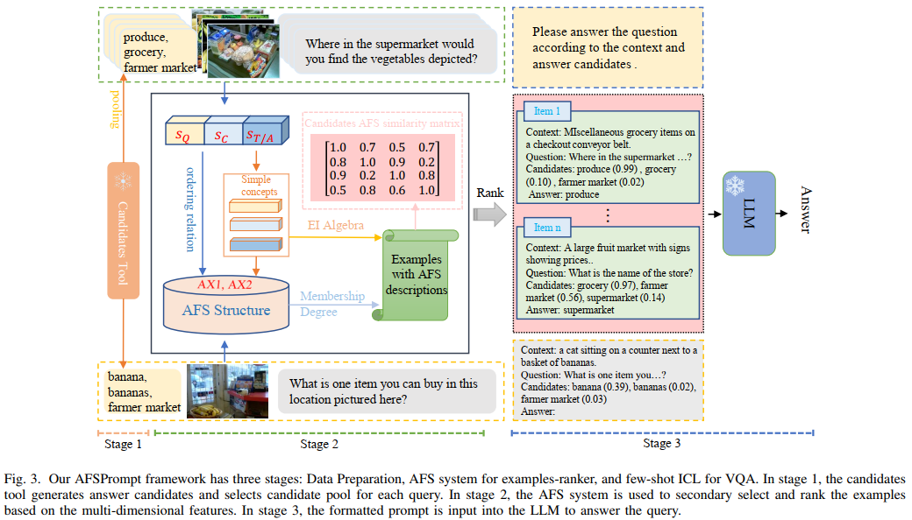

# [AFSPrompt: An Axiomatic Fuzzy Set Prompt Pipeline for Knowledge-Based VQA]
Despite the impressive few-shot performance of in-context learning (ICL) in knowledge-based visual question answering (VQA), existing research often prioritizes addressing the image information gap in VQA, while placing less emphasis on organizing appropriate demonstrations (e.g., in-context examples) to support this task. 
Recent studies, however, have shown that ICL performance is sensitive to the organization of demonstrations. To address this, we introduce axiomatic fuzzy set (AFS) theory into knowledge-based VQA, leveraging its unsupervised and interpretable nature to effectively organize demonstrations by describing each candidate with semantic concepts,
thereby enhancing both the understanding and trustworthiness of the decision-making process. In this paper, we propose AFSPrompt, a train-free example selection and ranking framework based on AFS theory for knowledge-based VQA tasks. After filtering irrelevant examples using multimodal embeddings, we apply AFS logic to integrate comparison information from candidates with multi-dimensional features. Furthermore, to reduce reliance on large-scale language model APIs such as OpenAI and facilitate model deployment, we employ a smaller 7B LLM as the knowledge engine to answer questions based on the optimized prompt. Through extensive evaluations on two datasets, we demonstrate the effectiveness of AFSPrompt within a lightweight pipeline for knowledge-based VQA tasks. 


## Project Structure
```plantuml
AFSPrompt/
├── AFS_rerank_system/         // Candidate scoring and reranking module
│   ├── candidate_rerank/      // Example reranking submodule
│   └── score_module/          // Scoring submodule
├── examples_filter/           // Example filtering using CLIP or similar models
├── dataset/                   // Datasets used in the framework
├── asserts/                   // Intermediate data storage
├── models/                    // Models used in the framework
├── outputs/                   // Output files generated by the framework
├── AFS_prompting/             // AFS prompting system
├── utils/                     // Utility functions and scripts
└── README.md                  // Project documentation
```

## Installation

To install the required dependencies, run:

```bash
pip install -r requirements.txt
```
## Usage

### Dataset
This framework can be applied to some VQA datasets, such as OK-VQA, A-OKVQA, TextVQA, and FVQA.
In addition, in our framework, the training set is used as a candidate set of demonstration examples.

### Examples Filter
This module provides scripts and configurations for handling candidate examples using `CLIP` or `MCAN` models.  
For related implementations, see: [PICa](https://github.com/microsoft/PICa) [Prophet](https://github.com/MILVLG/prophet)

### Feature processing
The features used in this framework are question (Q), Caption (C), optional feature tag (T), pre-answer (A) and knowledge (K).
- **Question(Q)**: Q from the original Q&A pair.
- **Caption(C)**: C from image related to the original Q&A pair by [`PromptCap`](https://huggingface.co/tifa-benchmark/promptcap-coco-vqa)/[`OFA`](https://github.com/OFA-Sys/OFA).
- Optional feature:
  - **Tag(T)**: T from image related to the original Q&A pair by [Azure Tagging API](https://learn.microsoft.com/en-us/azure/ai-services/computer-vision/concept-tagging-images).
  - **Pre-answer(A)**: A pre-answer generated by a [VQA](https://github.com/MILVLG/prophet) model.
  - **Knowledge(K)**: K is a knowledge base used for answering questions, for example, generated by [ChatGPT](https://openai.com/index/chatgpt/). You can also annotate it manually.

### AFS rerank system
The `AFS rerank system` directory contains modules for assertion and scoring. 
- `example rerank module` is used for reranking examples.
- `score module` is used for scoring the generated examples.

For the Matlab implementation of AFS theory, please refer to: [AFS](https://github.com/xdliuafs/AFS)

For the Python implementation of AFS theory, please refer to: [AFS](https://github.com/afs4ai/PyAFS)

### AFS Prompting
This module implements the AFS prompting system and supports various small large language models (such as Mistral, Llama, Gemma) as knowledge engines.  
For related implementations, see: [Prophet](https://github.com/MILVLG/prophet)

## Acknowledgements
This project is developed based on [https://github.com/MILVLG/prophet](https://github.com/MILVLG/prophet).

## Code update progress
- [x] Organize project structure and main modules
- [ ] Internal code testing and optimization
- [x] Write main documentation (README, usage instructions, etc.)
- [ ] Code release (to be made public after paper acceptance)
- [ ] Release example data and configurations

```bibte

```


